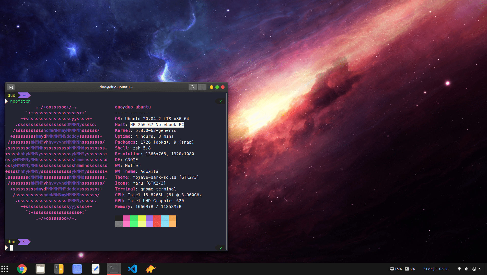

# :rocket: Ubuntu Workspace

Parametrizações de ambiente de desenvolvimento no Ubuntu 20.04



<br>

## :purple_circle: DEV TOOLS

**apt**

```
sudo apt update
sudo apt install -y git curl zsh unzip filezilla chrome-gnome-shell gnome-tweak-tool dconf-editor
```

**dpkg**

```
wget https://dl.google.com/linux/direct/google-chrome-stable_current_amd64.deb
sudo dpkg -i google-chrome-stable_current_amd64.deb
```

**snap**

```
sudo snap install code --classic
```

<br>

## :large_blue_circle: DOCKER

Seguir o tutorial do DigitalOcean para instalação do Docker e Docker Composer.
- [Docker](https://www.digitalocean.com/community/tutorials/how-to-install-and-use-docker-on-ubuntu-20-04-pt)
- [Docker Compose](https://www.digitalocean.com/community/tutorials/how-to-install-and-use-docker-compose-on-ubuntu-20-04-pt)

<br>

## :green_circle: OH MY ZSH

### Defir Zsh como shell padrão:

```shell
chsh -s $(which zsh)
```

Reiniciar a sessão, abrir o terminal e selecionar a opção 2.

Fazer clone do repositório `Oh My Zsh` no diretório pessoal, copiar o arquivo `zshrc.zsh-template` para o diretório pessoal e renomear-o para `.zshrc`:

```shell
git clone https://github.com/ohmyzsh/ohmyzsh.git ~/.oh-my-zsh
cp ~/.oh-my-zsh/templates/zshrc.zsh-template ~/.zshrc
```

### Instalando fonte Meslo

Clonar esse repositório e mover a fonte para o diretório `~/.fonts/`.

```shell
git clone https://github.com/lucasnemeses/ubuntu_workspace ~/Downloads/ubuntu_workspace
mkdir ~/.fonts/
mv ~/Downloads/ubuntu_workspace/src/Meslo\ LG\ M\ Regular\ for\ Powerline.ttf ~/.fonts/Meslo\ LG\ M\ Regular\ for\ Powerline.ttf
```

Adicionar o fonte ao terminal.

### Instalando Powerlevel9k

```shell
git clone https://github.com/bhilburn/powerlevel9k.git ~/.oh-my-zsh/custom/themes/powerlevel9k
```

Abrir o arquivo `~/.zshrc`:

```
nano ~/.zshrc
```

Comentar a linha `ZSH_THEME="robbyrussell"` e adicionar embaixo:

```
ZSH_THEME="powerlevel9k/powerlevel9k"

POWERLEVEL9K_LEFT_PROMPT_ELEMENTS=(user dir dir_writable vcs newline)
POWERLEVEL9K_RIGHT_PROMPT_ELEMENTS=(status)
```

### Instalando tema Dracula

```shell
git clone https://github.com/dracula/gnome-terminal ~/gnome-terminal
~/gnome-terminal/./install.sh
```

### Plugin ZSH

```shell
sh -c "$(curl -fsSL https://raw.githubusercontent.com/zdharma/zinit/master/doc/install.sh)"
```

Abrir o arquivo `~/.zshrc`:

```shell
nano ~/.zshrc
```

Adicionar o conteudo abaixo após `### End of ZInit's installer chunk`

```
zinit light zdharma/fast-syntax-highlighting
zinit light zsh-users/zsh-autosuggestions
zinit light zsh-users/zsh-completions
```

### Atalhos

Adicionar no arquivo `~/.zshrc` o conteúdo abaixo após `# alias ohmyzsh="mate ~/.oh-my-zsh"`.

```shell
nano ~/.zshrc
```

```
alias app="cd ~/app/"
alias dcup="docker-compose up -d"
alias dcdw="docker-compose down"
alias dcbs="docker-compose exec app bash"
alias sail='bash vendor/bin/sail'
alias dockersail='docker run --rm \
    -u "$(id -u):$(id -g)" \
    -v $(pwd):/opt \
    -w /opt \
    laravelsail/php80-composer:latest \
    composer install --ignore-platform-reqs'
```

<br>

## :yellow_circle: GNOME

### Extensões

- [Dash to Panel](https://extensions.gnome.org/extension/1160/dash-to-panel/)
- [Vitals](https://extensions.gnome.org/extension/1460/vitals/)

### Tema

Mover o diretório do tema para `~/.themes` e ao final realizar a troca do tema via gnome-tweaks.

```shell
sudo add-apt-repository universe
mkdir ~/.themes/
mv ~/Downloads/ubuntu_workspace/src/Mojave-dark-solid ~/.themes/Mojave-dark-solid
gnome-tweaks
```

<br>

## :red_circle: VS CODE

### Extensões

- Dracula Official
- Material Icon Theme
- PHP Intelephense
- Laravel Extra Intellisense
- Laravel Blade Snippets
- Laravel-goto-controller
- Laravel goto view
- laravel-blade
- Path Intellisense
- DotENV
- IntelliSense for CSS class names in HTML
- Auto Rename Tag
- Auto Close Tag
- markdownlint
- Markdown Emoji
- CodeSnap
- Thunder Client
- Import Cost
- Prettier
- Bracket Pair Colorizer 2
- GitLens — Git supercharged
- Inline Parameters for VSCode

### Fonte

Move o diretório da fonte JetBrains Mono para `~/.fonts`

```
mv ~/Downloads/ubuntu_workspace/src/JetBrainsMono-1.0.3 ~/.fonts/JetBrainsMono-1.0.3
```

No VS Code acessar o arquivo `settings.json` [Ctrl + ,] e adicionar o contedo abaixo.

```
"editor.fontFamily": "JetBrains Mono",
"editor.fontSize": 14,
"editor.fontLigatures": true
```
